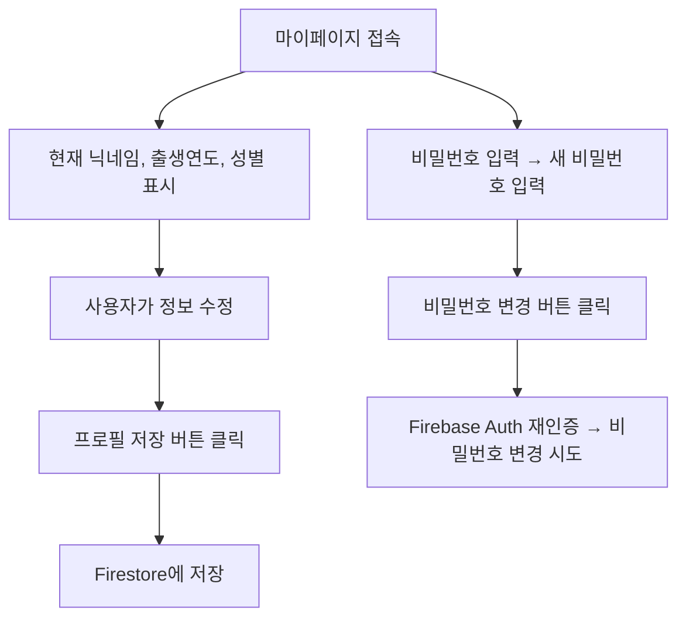

# 📌 PRD: 마이페이지 - 프로필 수정 & 비밀번호 변경

## 🧾 1. 기능 목적

- 사용자는 자신의 기본 회원 정보를 열람 및 수정할 수 있어야 한다.
- 이메일/비밀번호 기반 로그인 사용자는 **비밀번호 변경** 기능을 통해 보안을 강화할 수 있어야 한다.

---

## 🧩 2. 주요 기능

| 항목             | 설명                                                                 |
|------------------|----------------------------------------------------------------------|
| 닉네임 변경       | 사용자는 공개 닉네임을 자유롭게 수정할 수 있다. (투표/댓글에 노출)   |
| 출생연도 선택     | 1924~2024년 중 하나 선택 가능 (목록 드롭다운 제공)                   |
| 성별 선택        | 남 / 여 중 하나를 선택할 수 있다. (radio 버튼 UI)                    |
| 비밀번호 변경     | 기존 비밀번호 입력 → 새 비밀번호 입력 → 변경 시도                     |

---

## 🧭 3. 사용자 흐름 (User Flow)



---

## 🖥️ 4. 화면 구성

### 🧑 프로필 수정 영역
- 닉네임 `input[type=text]`
- 출생연도 `select` (옵션: 1924~2024년)
- 성별 `radio` 선택 (남 / 여)
- 저장 버튼 → 저장 성공/실패 메시지 `toast`

### 🔐 비밀번호 변경 영역
- 현재 비밀번호 `input[type=password]`
- 새 비밀번호 `input[type=password]`
- 변경 버튼 → 변경 성공/실패 메시지 `toast`

---

## 🔧 5. API & 데이터 구조

### Firestore
- 컬렉션: `users`
- 문서 ID: `uid`
- 필드 구조:
```ts
{
  nickname: string
  birthYear: string   // 예: "1988"
  gender: string      // "남" | "여"
}
```

### Firebase Auth
- `reauthenticateWithCredential` → 현재 비밀번호 확인
- `updatePassword` → 새 비밀번호로 변경

---

## ⚙️ 6. 개발 환경 및 의존성

- **프레임워크**: Next.js 14 (App Router)
- **Firebase SDK**: `firebase/app`, `firebase/auth`, `firebase/firestore`
- **State 관리**: `Zustand` - `useAuthStore`로 현재 사용자 정보 관리
- **UI**: Tailwind CSS
- **알림**: `sonner` 라이브러리 사용 (`toast.success`, `toast.error`)

---

## 🧪 7. 유효성 및 예외 처리

| 항목                  | 처리 방식 |
|-----------------------|-----------|
| 닉네임 비어있음        | 허용 (서버에서 빈 닉네임 저장 가능) |
| 출생연도 선택 안됨     | 허용 (선택 필수 아님)              |
| 성별 선택 안됨        | 허용 (선택 필수 아님)              |
| 비밀번호 변경 시       | 3개 입력값 모두 필수, 입력 누락 시 경고 |
| 재인증 실패           | `❌ 변경 실패: ...` 메시지 노출    |
| Firebase auth 실패    | 예외 메시지를 `err.message`로 출력  |

---

## ✅ 8. 성공 메시지 예시

- 프로필 저장: `✅ 프로필이 저장되었습니다.`
- 비밀번호 변경 성공: `🔐 비밀번호가 변경되었습니다.`
- 실패: `❌ 변경 실패: 비밀번호가 올바르지 않습니다.`

---

## 📎 9. 기타 참고 사항

- Firestore 문서가 없는 경우 새로 생성되지 않음 → `setDoc` 아님 `updateDoc` 사용.
- 비밀번호 변경은 로그인 방식이 **이메일/비밀번호**일 경우에만 가능 (SNS 로그인 불가).
- Firebase Auth 객체의 `user`는 Zustand로 글로벌 관리됨 (`useAuthStore` 사용).